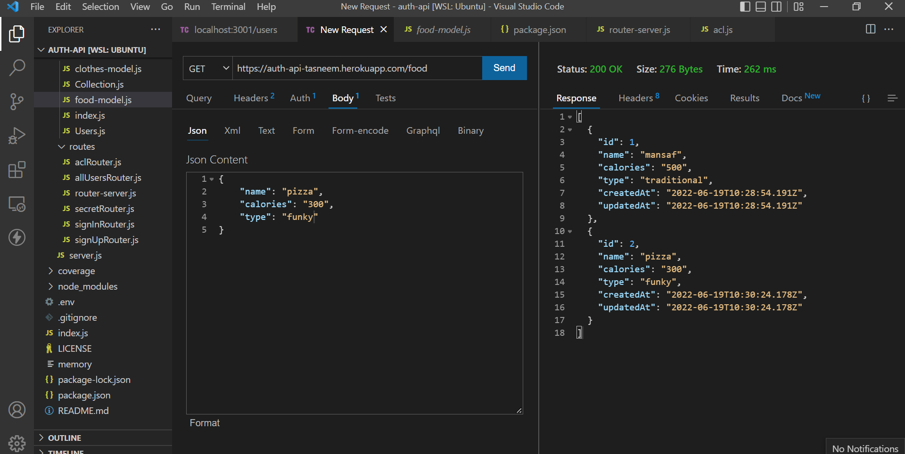
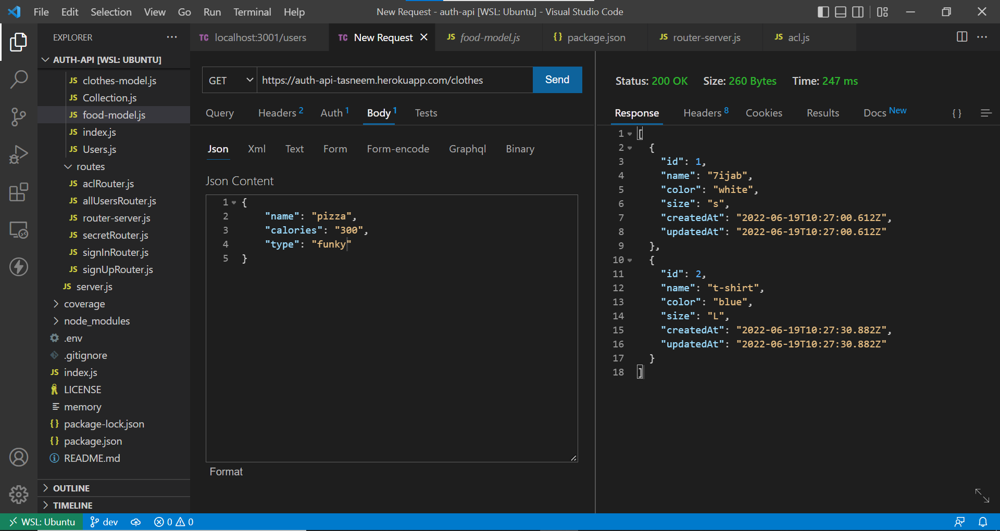

# auth-api

## [heroku link](https://auth-api-tasneem.herokuapp.com/) 
## [Action link](https://github.com/engTasneemmaq/auth-api/actions) 
## [Pull Request](https://github.com/engTasneemmaq/auth-api/pulls) 

## 
 

## 
 

 
 
 
 
 
 
 
 
 
 

